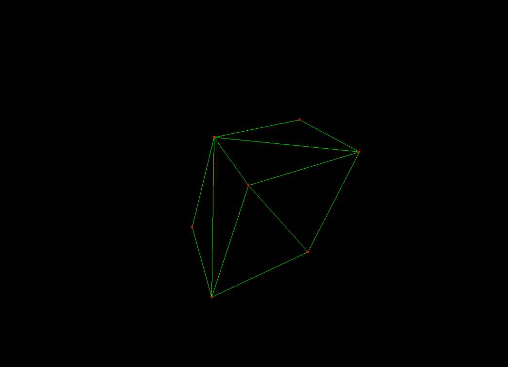

<div align="center">

# 3D Software Renderer

[](<https://en.wikipedia.org/wiki/C_(programming_language)>)
[](https://www.gnu.org/software/make/)




</div>

---

## About

This project is a standalone **3D software rendering engine** written from scratch in C, without graphics APIs such as OpenGL or DirectX. It is based on the course by **Gustavo Pezzi**, and extends the original code with the following optimizations:

1. **Line drawing:** The original code used the **DDA** (Digital Differential Analyzer) algorithm. I replaced it with **Bresenham's line algorithm**, generalized to handle all eight octants.
2. **Painter's algorithm:** The original code sorted faces by average depth using **bubble sort**. I wrote a separate header library, `sort.h`, with generic **quicksort** and **merge sort** implementations. I chose merge sort for depth sorting because it is stable: faces with equal average depth keep their original order.
3. **Matrix transformations:** The original code supported scaling and rotation about the cardinal axes only. I applied **Rodrigues' rotation formula** so objects can rotate about any arbitrary axis through the origin, and extended scaling to work along arbitrary axes as well.

## Features

- **Perspective projection:** projects 3D points onto the 2D screen (x–y plane)
- **Back-face culling:** hides faces pointing away from the camera, so only front faces are drawn
- **Drawing primitives:** draws pixels, rectangles, and lines between any two points on the screen
- **Model loading:** reads Wavefront (`.obj`) models, as well as mesh data from `.csv` files
- **Triangle rasterization:** fills triangle faces with custom colors
- **Depth-ordered rendering:** sorts faces by their average z-depth before drawing
- **Matrix transformations:** applies rotation, scaling, and translation to models

## Built With

| Component | Tool |
| :-------- | :--- |
| Language  | C    |
| Build     | Make |

## Getting Started

### Prerequisites

- `gcc` or `clang`
- `make`

### Installation

```bash
# Clone the repository
git clone https://github.com/YOUR-USERNAME/YOUR-REPO.git
cd YOUR-REPO

# Build the project
make

# Run the renderer
make run
```

## Controls

| Key | Action                                         |
| --- | ---------------------------------------------- |
| `1` | Wireframe with red vertex dots and green lines |
| `2` | White wireframe                                |
| `3` | Filled faces, each with a different colour     |
| `4` | Filled faces with a black wireframe overlay    |
| `c` | Enable back-face culling                       |
| `d` | Disable back-face culling                      |

## Project Status

> Version 1.0 is currently in progress.

## Credits

Thanks to **Gustavo Pezzi** for his online 3D computer graphics course at [Pikuma](https://pikuma.com).
